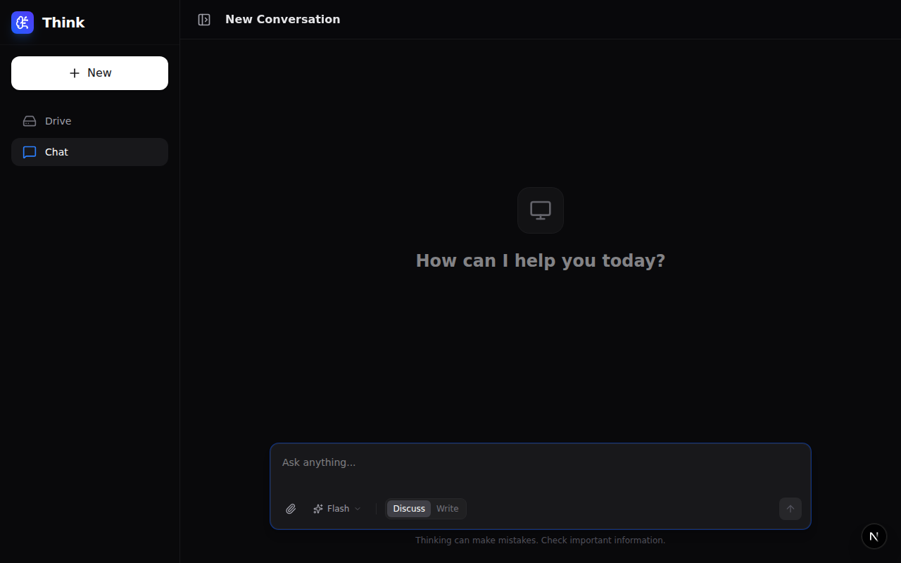
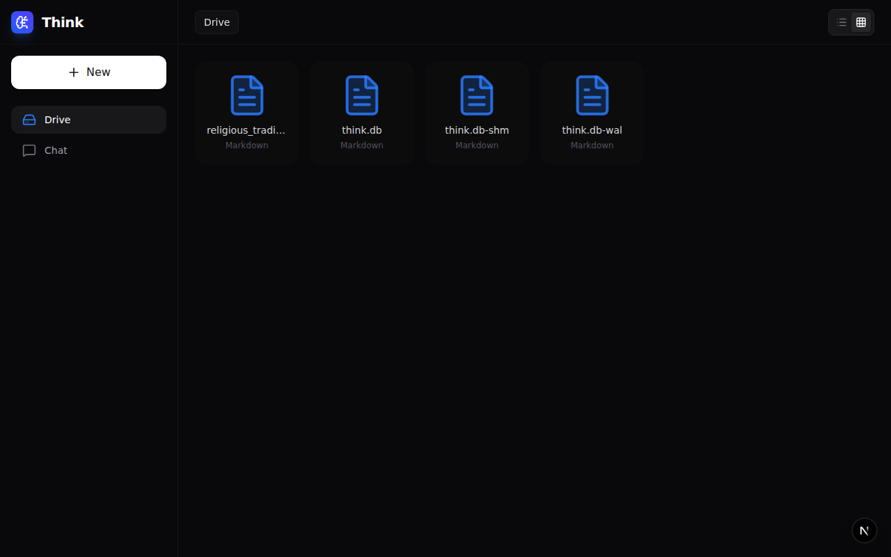
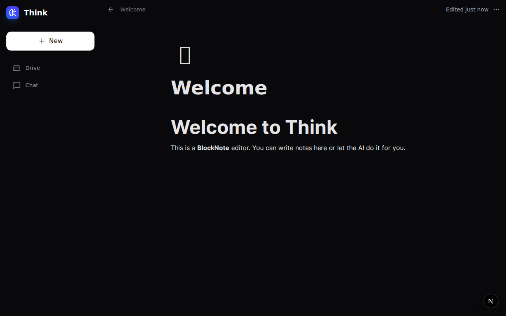

# Think: The AI-Powered Conversational Workspace

> **A reasoning-focused agent with direct agency over your local files.**

Think is a Next.js application that combines powerful conversational AI with a local file system, creating an intelligent agent capable of thinking, reasoning, and acting within a sandboxed digital workspace.

---

## 📸 Showcase

### 💬 Conversational Intelligence

Featuring **Tree-Based History** (branch your conversations like Git) and **Context Compression** (JSON-based session memory to save tokens).

### 📂 File System Agency

A dedicated `drive_data/` sandbox where the AI can list, read, write, and manage your documents autonomously through a natural chat interface.

### 📝 Smart Documentation

A Notion-style **BlockNote** editor. You can write notes manually or let the AI refine them. Use the "Chat with this file" feature to instantly bring document context into your conversation.

---

## 🏗️ The "Dual-Brain" Architecture

Think is designed to be environment-agnostic. It detects its platform and swaps its runtime engine automatically, sharing 90% of the same UI and logic code:

- **Web Mode:** Runs on Node.js/Next.js using `better-sqlite3` and standard server API routes.
- **Mobile Mode:** Runs as an offline-first **Native Android App** using Capacitor, with on-device SQLite and Filesystem access.

---

## 🚀 Core Features

- **Autonomous Agency:** The AI is equipped with tools to `list_files`, `read_file`, `write_file`, and `delete_file`.
- **Safety Modes:** 
    - **Discuss Mode (Default):** Read-only access for safe brainstorming.
    - **Write Mode:** Grants the AI permission to modify your workspace.
- **Context Compression:** A background "Summarizer" loop maintains a JSON summary of your goals and constraints, keeping the AI focused during long sessions without hitting token limits.
- **Tree-Based History:** Edit any previous message to create a new branch. Explore different outcomes without losing your original conversation.
- **Configurable Persona:** The AI's rules and personality are defined in `prompt.txt`—change the agent's "soul" without touching a line of code.

---

## 🛠️ Tech Stack

- **Framework:** [Next.js 15](https://nextjs.org/) (App Router)
- **AI Engine:** [Google Gemini](https://deepmind.google/technologies/gemini/) via [LangChain.js](https://js.langchain.com/)
- **Editor:** [BlockNote](https://www.blocknotejs.org/)
- **Database:** Local [SQLite](https://www.sqlite.org/) (better-sqlite3 / Capacitor SQLite)
- **Mobile:** [Capacitor.js](https://capacitorjs.com/)
- **Styling:** [Tailwind CSS](https://tailwindcss.com/), [Framer Motion](https://www.framer.com/motion/)

---

## 🚦 Getting Started

### Prerequisites
- Node.js (v18 or later)
- Google AI Studio API Key

### 1. Installation
```bash
npm install
```

### 2. Environment Setup
Create a `.env.local` file:
```bash
cp .env.example .env.local
```
Add your `GOOGLE_API_KEY` to the file.

### 3. Running the App
```bash
npm run dev
```

---

## 📁 Project Structure

- **/app/api/chat/route.ts**: Core AI agent logic and streaming engine.
- **/app/chat/**: Tree-based chat interface.
- **/app/editor/**: BlockNote integration and document management.
- **/lib/mobile/**: Native bridge for Android/iOS offline functionality.
- **/drive_data/**: The AI's sandboxed workspace (only place it can read/write).
- **prompt.txt**: Defines the AI's persona and operating principles.
